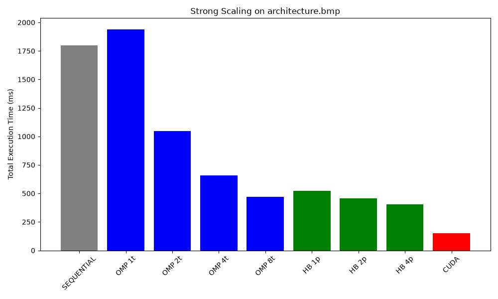
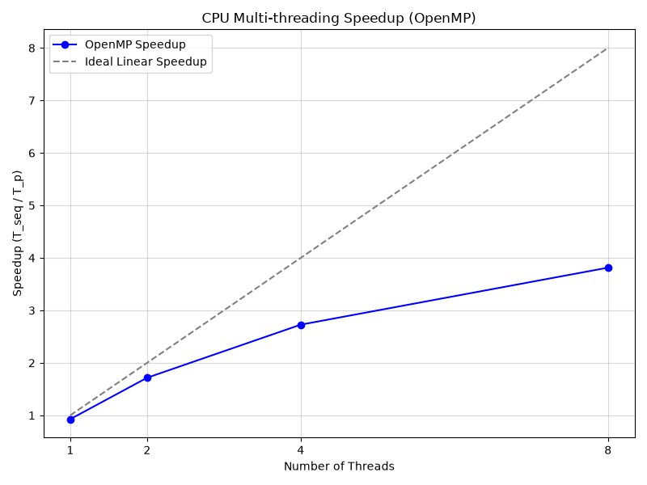
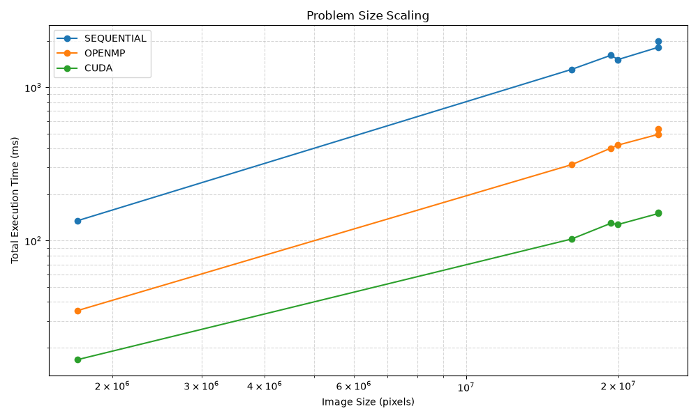
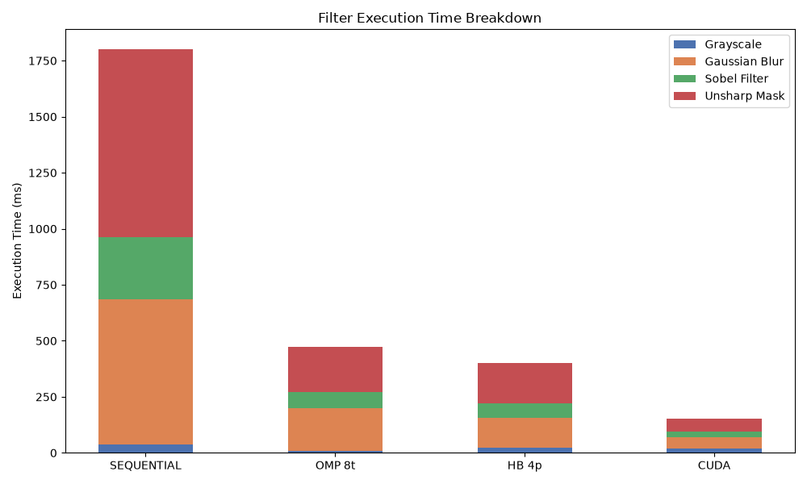

# Hybrid Image Processing in C (CUDA/MPI/OpenMP)

An engineering case study in high-performance computing, exploring image processing parallelization through Shared Memory (OpenMP), Distributed Memory (MPI), and Massively Parallel GPU Acceleration (CUDA).

## Project Overview

The objective of this project is to apply a computationally intensive image processing pipeline to high-resolution, uncompressed Bitmap (BMP) images. The pipeline consists of four distinct filters executed in sequence:
1. **Grayscale Conversion**
2. **Separable Gaussian Blur**
3. **Sobel Edge Detection**
4. **Unsharp Masking (Sharpening)**

Instead of simply applying the filters sequentially, this project acts as an optimization playground. The same pipeline is implemented across four different execution models to evaluate scaling laws, hardware limitations, and parallel programming paradigms.

## 🚀 Execution Models

- `image_seq.exe`: **Sequential Baseline**. Single-threaded execution on the CPU.
- `image_omp.exe`: **OpenMP Model**. Multi-threaded execution scaling across CPU cores utilizing shared memory.
- `image_hb.exe`: **Hybrid Model (MPI + OpenMP)**. Distributed memory architecture dividing the image into slices, combined with local multi-threading.
- `image_cu.exe`: **CUDA Model**. Complete GPU offloading, mapping pixels to thousands of GPU threads and minimizing PCIe transfers.

---

## 📊 Performance Analysis & Benchmarks

The benchmark environment for all following data is standardized to ensure reproducibility:
- **CPU:** AMD Ryzen (x86_64 architecture)
- **GPU:** NVIDIA GeForce RTX 4060 Laptop GPU
- **RAM:** 32 GB DDR5
- **OS:** Windows 11
- **Compiler:** MSYS2 GCC 14.2.0 (UCRT64)
- **CUDA Toolkit:** v13.3
- **MPI:** MS-MPI v10.1

*Data was collected automatically using the included `bench_scaling.bat` script, which isolates the compute pipeline's execution time (excluding file I/O) via standard `omp_get_wtime()` and CUDA event timers.*

### 1. Strong Scaling (Execution Time vs. Parallelism)



- **What it represents:** This graph shows the total execution time of the image processing pipeline as the number of compute threads/processes increases, while keeping the workload (image size) constant.
- **Benchmark Configuration:** Tested on `architecture.bmp` (6000x4000, 24 Megapixels). Sequential (1 thread), OpenMP (1, 2, 4, 8 threads), Hybrid MPI (1, 2, 4 processes with 8 threads each), and CUDA.
- **Interpretation & Takeaway:** The sequential baseline takes roughly 1.8 seconds. OpenMP multi-threading cuts this time down dramatically as thread counts increase, demonstrating strong shared-memory scaling. However, the CUDA implementation obliterates CPU times, dropping the total execution down to roughly ~150ms. The key takeaway is that for highly parallel, fixed-size mathematical operations like image convolutions, GPU acceleration is orders of magnitude faster than even a fully saturated CPU.

### 2. Multi-threading Efficiency (Amdahl's Law)



- **What it represents:** This graph plots the theoretical "Ideal Linear Speedup" (where $N$ threads means exactly $N$ times faster) against the *actual* observed speedup of the OpenMP CPU implementation. Speedup is calculated as $T_{seq} / T_{parallel}$.
- **Benchmark Configuration:** Tested on `architecture.bmp` (24 MP), evaluating the OpenMP model across 1, 2, 4, and 8 threads.
- **Interpretation & Takeaway:** The graph demonstrates near-linear scaling up to 4 threads. However, as thread counts approach the physical hardware limit (8 threads), the efficiency drops and the curve flattens. This is a textbook demonstration of **Amdahl's Law**: the strictly serial parts of the application (thread spawning overhead, barrier synchronization, OS scheduling) ultimately bottleneck the maximum achievable speedup, preventing perfect linear scaling.

### 3. Problem Size Scaling (Weak-ish Scaling)



- **What it represents:** A log-log plot showing how execution time scales as the input problem size (total number of image pixels) increases across different models.
- **Benchmark Configuration:** Evaluated across 6 different images ranging from 1.7 Megapixels (`cat_portrait.bmp`) to 24 Megapixels (`architecture.bmp`), using Sequential, fully saturated OpenMP, and CUDA.
- **Interpretation & Takeaway:** The execution times for both the sequential and OpenMP models grow linearly with the problem size, as evidenced by the steep slopes. In contrast, the CUDA model's execution time remains extremely low and grows at a much slower rate. The massive parallel bandwidth of the RTX 4060 easily absorbs the increased workload, proving that GPUs are highly resilient to problem-size scaling compared to CPUs.

### 4. Filter Execution Breakdown



- **What it represents:** A stacked bar chart dissecting the total execution time into the individual filters: Grayscale, Gaussian Blur, Sobel, and Unsharp Mask.
- **Benchmark Configuration:** Tested on `architecture.bmp` (24 MP). Compares Sequential, the best OpenMP run, the best Hybrid run, and CUDA.
- **Interpretation & Takeaway:** Gaussian Blur and Unsharp Mask dominate the sequential execution time due to their higher arithmetic intensity and memory accesses. When parallelized with OpenMP, the compute-bound Blur operation scales beautifully. However, the CUDA model is so fast that the compute time for *all* filters is nearly entirely squashed. This highlights that parallelizing computationally dense operations (like 2D separable convolutions) yields the highest return on investment.

---

## 📚 Technical Documentation

Deep dive into the engineering methodology and architecture decisions:

1. **[System Architecture](docs/architecture.md):** Detailed breakdown of the execution pipeline and parallel paradigms.
2. **[Algorithmic Decisions](docs/algorithms.md):** Mathematical and programmatic details of the filters (e.g., Separable Convolution, Halo Exchanges).
3. **[Performance Analysis](docs/performance_analysis.md):** Roofline analysis, Amdahl's Law observations, caching effects, and PCIe transfer bottlenecks.
4. **[Benchmark Reports](docs/benchmarks.md):** Full methodology and hardware specifications.

## 🛠️ Build and Usage Instructions

### Prerequisites
- GCC Compiler (with OpenMP support)
- Microsoft MPI (MS-MPI) or OpenMPI
- NVIDIA CUDA Toolkit (v13+)
- GNU Make

### Building the Project
Clone the repository and build the executables using `make`.

```bash
# Build the sequential, OpenMP, and Hybrid (MPI) executables
make all

# Build the CUDA executable
make cu
```

### Running the Project

The executables expect 5 positional arguments: the input image, followed by the four output files for each pipeline stage.

```bash
# 1. Run Sequential
./image_seq.exe input.bmp gray.bmp blur.bmp sobel.bmp out.bmp

# 2. Run OpenMP (Set threads via environment variable)
OMP_NUM_THREADS=8 ./image_omp.exe input.bmp gray.bmp blur.bmp sobel.bmp out.bmp

# 3. Run Hybrid (MPI)
mpiexec -n 4 ./image_hb.exe input.bmp gray.bmp blur.bmp sobel.bmp out.bmp

# 4. Run CUDA
./image_cu.exe input.bmp gray.bmp blur.bmp sobel.bmp out.bmp
```

*(You can also use the included `make bench` command to automatically run all models sequentially against a sample image).*

---

## 🔮 Future Improvements
- **Pinned Host Memory:** Using `cudaMallocHost` for zero-copy memory transfers to completely hide PCIe latency.
- **Shared Memory in CUDA:** Utilizing GPU Shared Memory for the separable blur to minimize redundant global memory fetches.
- **Asynchronous Execution:** Pipelining CUDA streams so that large images can be chunked and streamed to the GPU concurrently.
