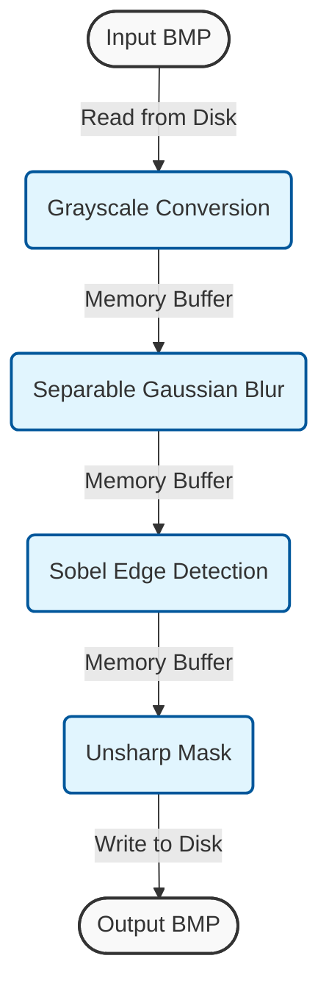
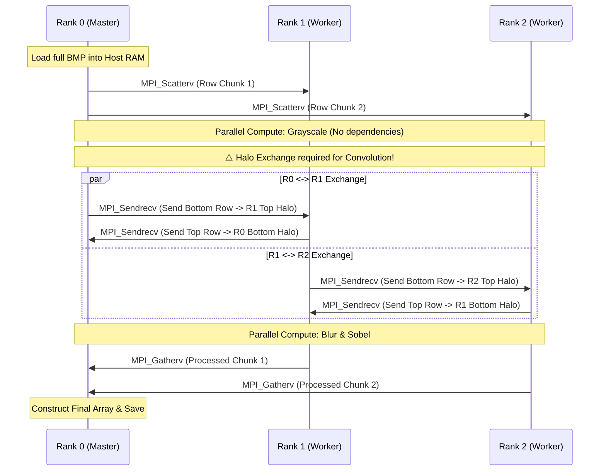

# Project Architecture & Workflow Diagrams

This document illustrates the core architectural concepts of the Hybrid Image Processing pipeline. Understanding these workflows is essential for grasping how the system extracts performance across different hardware topologies.

## 1. Image Processing Compute Pipeline

The core pipeline is identical across all models. The filters run in a strict sequence because each stage depends on the exact output of the preceding stage. By executing these sequentially but parallelizing the *internal workload* of each filter, we maximize throughput.



## 2. Distributed Memory: MPI Halo Exchange Workflow

The most complex implementation in this project is the Hybrid MPI+OpenMP model. Because processes operate in isolated memory spaces (distributed memory), they cannot simply read neighboring pixels from a shared array when performing convolutions like Gaussian Blur or Sobel Edge Detection. 

To solve this, we implement a **Halo Exchange** (or Ghost Zone swapping). Before a convolution, adjacent ranks exchange their boundary rows.


*Why this diagram adds value: It instantly demonstrates to a technical recruiter that you understand distributed computing paradigms, synchronization, and how to handle data dependencies across process boundaries.*

## 3. Massively Parallel: CUDA Execution & Memory Model

The CUDA implementation drastically outperforms the CPU models. This diagram explains why: **PCIe transfer minimization**. 

Instead of copying memory back and forth between the CPU and GPU for every filter, the original image is sent to the GPU once (H2D). All four filter kernels execute sequentially directly in VRAM, reusing allocated device buffers. The image is only copied back to the CPU (D2H) when the entire pipeline is complete.

```mermaid
graph LR
    subgraph Host (System RAM)
        direction TB
        A[Original Image]
        F[Final Sharpened Image]
    end
    
    subgraph Device (GPU VRAM)
        direction TB
        B[d_data]
        C[d_temp]
        D[d_blurred]
        E[d_grad]
        
        B -->|RGB2Gray Kernel| C
        C -->|OneDBlur Kernel X & Y| D
        B -->|Sobel Kernel| E
        D -->|Unsharp Blend Kernel| B
    end
    
    A -->|cudaMemcpy H2D| B
    B -->|cudaMemcpy D2H| F
    
    classDef host fill:#fff3e0,stroke:#e65100,stroke-width:2px;
    classDef device fill:#e8f5e9,stroke:#1b5e20,stroke-width:2px;
    class A,F host;
    class B,C,D,E device;
```
*Why this diagram adds value: It proves you understand the most critical bottleneck in GPGPU programming—host-to-device memory transfer latency—and have engineered a pipeline to avoid it.*
