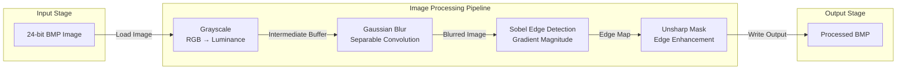
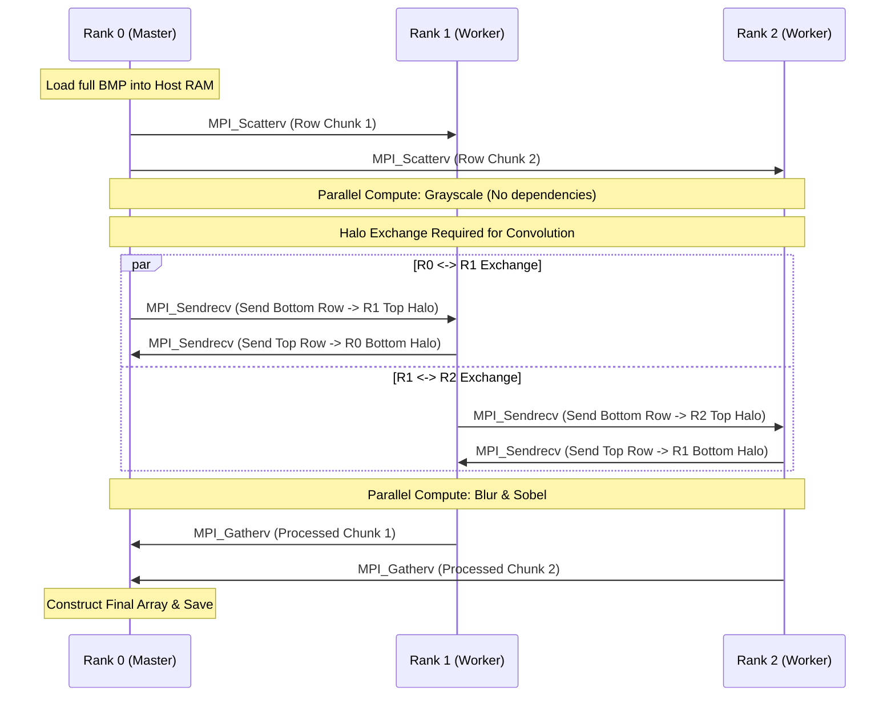
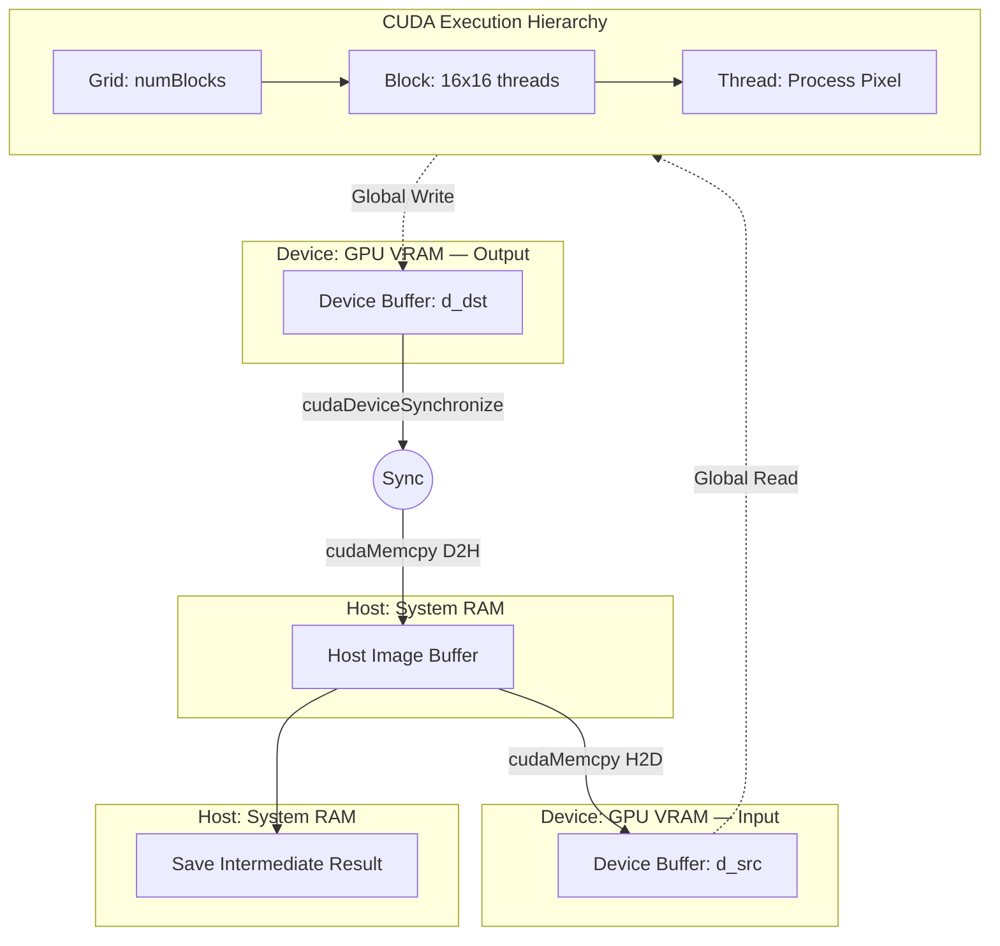

# Project Architecture & Workflow Diagrams

This document illustrates the core architectural concepts of the Hybrid Image Processing pipeline. Understanding these workflows is essential for grasping how the system extracts performance across different hardware topologies.

## 1. Image Processing Compute Pipeline

The core pipeline is identical across all models. The filters run in a strict sequence because each stage depends on the exact output of the preceding stage. By executing these sequentially but parallelizing the *internal workload* of each filter, we maximize throughput.

## 2. Distributed Memory: MPI Halo Exchange Workflow

The most complex implementation in this project is the Hybrid MPI+OpenMP model. Because processes operate in isolated memory spaces (distributed memory), they cannot simply read neighboring pixels from a shared array when performing convolutions like Gaussian Blur or Sobel Edge Detection. 

To solve this, we implement a **Halo Exchange** (or Ghost Zone swapping). Before a convolution, adjacent ranks exchange their boundary rows.

*Why this diagram adds value: It instantly demonstrates to a technical recruiter that you understand distributed computing paradigms, synchronization, and how to handle data dependencies across process boundaries.*

## 3. Massively Parallel: CUDA Execution & Memory Model

The CUDA implementation drastically outperforms the CPU models by leveraging massive thread-level parallelism. 

The diagram below illustrates the actual lifecycle of a typical filter operation (e.g., Gaussian Blur) within our pipeline. To allow for intermediate disk saves, the host explicitly manages `cudaMemcpy` operations before and after each filter, while the GPU handles the heavy arithmetic intensity via a highly structured Grid and Block execution hierarchy.

*Why this diagram adds value: It proves you understand the intricate execution model of CUDA (Host vs. Device distinction, manual memory transfers, and the Thread/Block/Grid mapping).*
